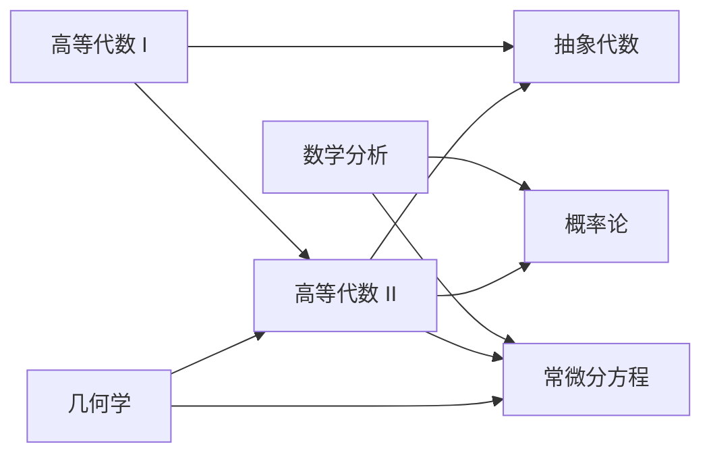

# 数学

地图

## 数学分析

### 一元微积分

* 函数：实数理论，确界存在定理，函数概念和性质，初等函数
* 序列极限：序列极限定义，无穷小和无穷大量，序列极限的性质，单调有界序列，实数连续性的基本性质，柯西收敛准则，上/下极限
* 函数的极限和连续性
* 导数和微分
* 导数的应用：微分中值定理，洛必达法则，泰勒公式，用导数研究函数
* 不定积分
* 定积分

### 级数

* 数项级数
* 函数序列和函数级数
* 幂级数
* 傅里叶级数

### 多元微积分

* $\R^n$ 中的点集拓扑初步，连续函数
* 多元函数微分
* 隐函数定理
* 多元函数的极值问题
* 重积分
* 曲线积分、曲面积分和场论初步

## 概率论

- 古典概型与概率空间

- 随机变量与概率分布

- 随机向量及其分布

- 数学期望与方差

- 概率极限理论

## 常微分方程

## 复变函数

## 实变函数

先修课程：数学分析

* 集合与欧式空间的点集
* 勒贝格测度
* 可测函数与可测函数列的收敛
* 勒贝格积分
* 微分与积分的关系
* $L^p$ 空间

## 数学模型

先修课程：数学分析、线性代数、概率论、常微分方程

* 线性规划模型
* 动态规划模型
* 图和网络模型
* 马氏链和隐马氏链模型
* 种群动力学模型
* 分类模型

## 微分几何

## 偏微分方程

## 拓扑学

## 微分几何

## 数论基础

## 基础代数几何

## 数理统计

先修课程：数学分析、高等代数、概率论

### 估计

### 假设检验

### 线性模型与回归分析

### 试验设计与方差分析

### 序贯分析

### 统计决策与贝叶斯统计

## 应用随机过程

先修课程：数学分析、高等代数、概率论

* 随机游走
* 离散时间马氏链
* 泊松过程
* 连续时间参数马氏过程
* 布朗运动

